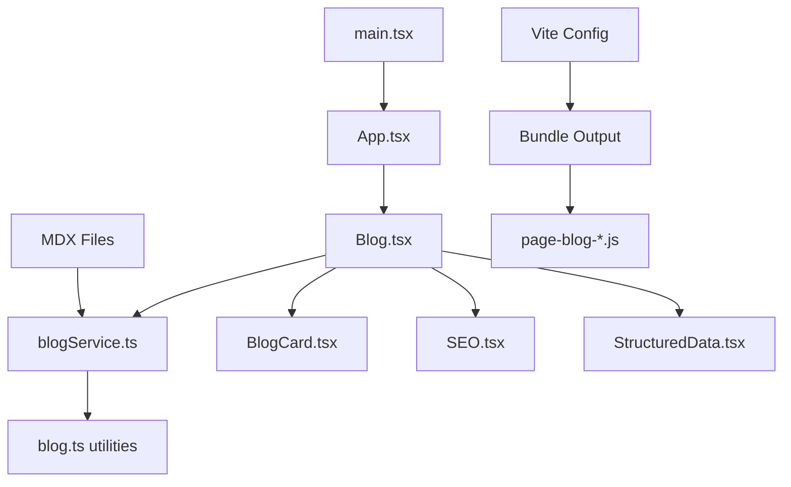

# Design Document

## Overview

The JavaScript runtime error "Cannot access 'a' before initialization" indicates a Temporal Dead Zone (TDZ) violation in the bundled code. This typically occurs when variables are accessed before their declaration due to improper hoisting, circular dependencies, or incorrect module loading order. The error specifically appears in the `page-blog-BF4Bcp1g.js` file, suggesting the issue is related to the Blog page component or its dependencies.

Based on the analysis, the most likely causes are:

1. Circular dependencies between modules
2. Incorrect variable hoisting in the bundled output
3. MDX compilation issues creating invalid JavaScript
4. Module loading order problems with dynamic imports

## Architecture

### Error Detection and Debugging Strategy

The solution will implement a multi-layered approach:

1. **Build-time Analysis**: Enhance build configuration to detect and prevent problematic patterns
2. **Runtime Error Handling**: Improve error boundaries and logging to capture more detailed error information
3. **Module Structure Validation**: Analyze and fix circular dependencies and import/export patterns
4. **Bundle Optimization**: Adjust Vite configuration to generate more reliable JavaScript output

### Component Dependencies Analysis



## Components and Interfaces

### Enhanced Error Boundary

```typescript
interface ErrorBoundaryProps {
  children: React.ReactNode;
  fallback?: React.ComponentType<ErrorFallbackProps>;
  onError?: (error: Error, errorInfo: ErrorInfo) => void;
  resetKeys?: Array<string | number>;
}

interface ErrorFallbackProps {
  error: Error;
  resetError: () => void;
  errorInfo?: ErrorInfo;
}
```

### Build Configuration Interface

```typescript
interface BuildConfig {
  sourcemap: boolean;
  minify: boolean | 'terser' | 'esbuild';
  target: string;
  rollupOptions: {
    output: {
      manualChunks: (id: string) => string | undefined;
      chunkFileNames: string;
      entryFileNames: string;
    };
    external?: string[];
  };
}
```

### Module Loading Interface

```typescript
interface ModuleLoader {
  loadBlogPosts(): Promise<BlogPost[]>;
  getBlogPost(slug: string): Promise<BlogPost | null>;
  clearCache(): void;
}
```

## Data Models

### Error Tracking Model

```typescript
interface ErrorReport {
  id: string;
  timestamp: Date;
  error: {
    message: string;
    stack?: string;
    name: string;
  };
  context: {
    url: string;
    userAgent: string;
    component?: string;
    props?: Record<string, unknown>;
  };
  buildInfo: {
    version: string;
    environment: 'development' | 'production';
    bundleHash?: string;
  };
}
```

### Module Dependency Model

```typescript
interface ModuleDependency {
  path: string;
  imports: string[];
  exports: string[];
  circularDependencies: string[];
  isProblematic: boolean;
}
```

## Error Handling

### Build-time Error Prevention

1. **Circular Dependency Detection**: Implement build-time analysis to detect and report circular dependencies
2. **Variable Hoisting Validation**: Add ESLint rules to prevent TDZ violations
3. **Module Import/Export Validation**: Ensure all imports and exports are properly structured

### Runtime Error Recovery

1. **Enhanced Error Boundaries**: Implement more granular error boundaries with better error reporting
2. **Graceful Degradation**: Provide fallback content when components fail to load
3. **Error Reporting**: Implement client-side error reporting for production debugging

### MDX Processing Safeguards

1. **Content Validation**: Validate MDX files before processing
2. **Compilation Error Handling**: Catch and handle MDX compilation errors gracefully
3. **Dynamic Import Safety**: Ensure dynamic imports for MDX files are properly handled

## Testing Strategy

### Unit Testing

1. **Module Loading Tests**: Test blog service functions in isolation
2. **Error Boundary Tests**: Verify error boundaries catch and handle errors correctly
3. **Utility Function Tests**: Test blog utilities for edge cases

### Integration Testing

1. **Component Integration**: Test Blog page component with mock data
2. **Routing Tests**: Verify navigation to blog pages works correctly
3. **MDX Processing Tests**: Test MDX file loading and parsing

### Build Testing

1. **Bundle Analysis**: Analyze bundle output for problematic patterns
2. **Dependency Graph Testing**: Verify no circular dependencies exist
3. **Production Build Testing**: Test production builds in isolated environment

### Error Simulation Testing

1. **TDZ Error Simulation**: Create test cases that simulate the specific error
2. **Network Error Testing**: Test behavior when MDX files fail to load
3. **Malformed Content Testing**: Test handling of invalid MDX content

## Performance Considerations

### Bundle Optimization

1. **Code Splitting**: Ensure proper code splitting for blog-related components
2. **Tree Shaking**: Verify unused code is properly eliminated
3. **Chunk Size Management**: Optimize chunk sizes for better loading performance

### Memory Management

1. **Cache Management**: Implement proper cache invalidation for blog posts
2. **Component Cleanup**: Ensure components properly clean up resources
3. **Memory Leak Prevention**: Monitor for memory leaks in error scenarios

## Security Considerations

### Content Security

1. **MDX Content Sanitization**: Ensure MDX content is properly sanitized
2. **Dynamic Import Security**: Validate dynamic imports are secure
3. **Error Information Exposure**: Prevent sensitive information leakage in error messages

### Build Security

1. **Dependency Validation**: Ensure all dependencies are secure and up-to-date
2. **Build Process Security**: Secure the build process against injection attacks
3. **Source Map Security**: Properly configure source maps for production
