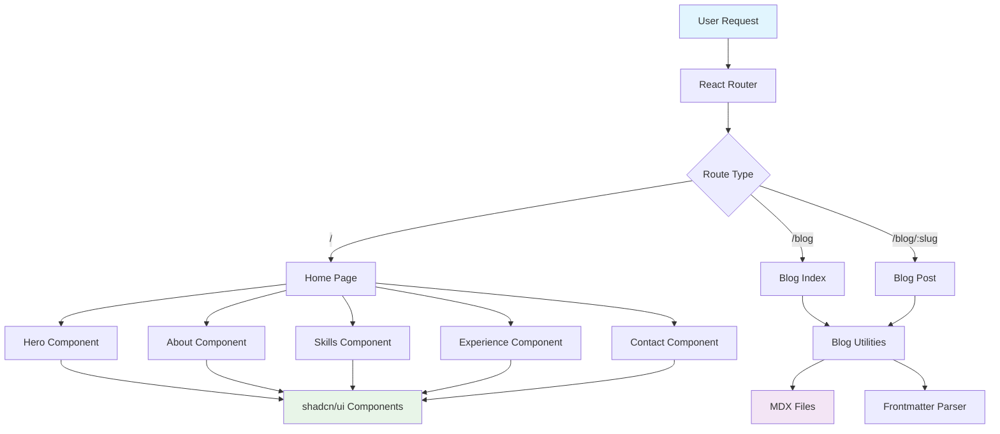
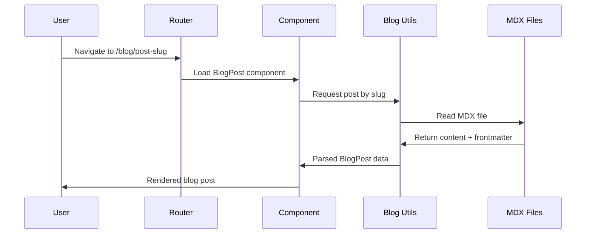

# From Requirements to Architecture: Design-Driven Development

In the previous post, we explored how to transform rough ideas into structured requirements using the EARS format. Now comes the critical next step: translating those requirements into a comprehensive design that serves as the blueprint for implementation.

This isn't about jumping straight into code. It's about systematic thinking, research-driven decisions, and creating a design that methodically addresses every requirement while setting up the development team for success.

## The Requirements-to-Design Bridge

The transition from requirements to design is where many projects stumble. Requirements tell us _what_ to build, but design tells us _how_ to build it. This bridge requires careful research, architectural thinking, and systematic decision-making.

Let's examine how this works in practice using our personal landing page project.

### Starting with Requirements Analysis

Before making any design decisions, we need to understand what our requirements are actually asking for. From our personal landing page requirements, we identified several key themes:

**Technical Foundation Requirements (Requirement 1)**

- Modern React project with TypeScript
- Vite build system with MDX support
- Tailwind CSS and shadcn/ui integration

**User Experience Requirements (Requirements 2, 4)**

- Professional landing page with clear sections
- Seamless client-side navigation
- Responsive design across all devices

**Content Management Requirements (Requirement 3)**

- MDX blog system with frontmatter
- Syntax highlighting for code blocks
- GitHub Flavored Markdown support

**Operational Requirements (Requirements 5, 6, 7)**

- GitHub Pages deployment
- Performance and SEO optimization
- Developer experience with hot reloading

Each requirement category demands different design considerations and research approaches.

## Research and Context Gathering

Effective design starts with thorough research. You can't make informed architectural decisions without understanding the landscape of available solutions, best practices, and potential constraints.

### Technology Stack Research

For our personal landing page, the requirements specified React + Vite + Tailwind CSS + shadcn/ui. But why these choices? The design document needed to validate and expand on these decisions:

**React 18+ Selection**

- Research showed React 18's concurrent features would benefit our blog system
- Server Components weren't needed for a static site, but concurrent rendering would improve UX
- Large ecosystem support for MDX integration

**Vite Build Tool Analysis**

- Faster development server than Create React App
- Better MDX plugin ecosystem
- Optimized production builds with tree shaking
- Native TypeScript support without additional configuration

**Tailwind CSS + shadcn/ui Combination**

- Utility-first approach reduces CSS bundle size
- shadcn/ui provides accessible components built on Radix UI
- Consistent design system without heavy component library overhead

This research informed our technology stack decisions and provided rationale for each choice.

### Architecture Pattern Research

The requirements called for both a landing page and blog system. This demanded research into:

**Single Page Application (SPA) vs. Static Site Generation**

- GitHub Pages deployment favored SPA approach
- Client-side routing met navigation requirements
- MDX compilation could happen at build time

**Component Architecture Patterns**

- Feature-based organization vs. type-based organization
- Composition patterns for reusable UI components
- State management needs (minimal for this project)

**Content Management Approaches**

- File-based content vs. headless CMS
- MDX processing and frontmatter parsing
- Blog post discovery and metadata extraction

## Component and Interface Design Methodology

With research complete, we moved to systematic component design. This isn't about visual design—it's about architectural design that addresses functional requirements.

### Hierarchical Component Breakdown

Starting from the requirements, we identified the component hierarchy:

```
App (Root)
├── RootLayout (Consistent structure)
│   ├── Navigation (Section navigation)
│   └── Footer (Contact info)
├── Home Page
│   ├── Hero (Name, title, CTA)
│   ├── About (Background story)
│   ├── Skills (Technical abilities)
│   ├── Experience (Professional history)
│   └── Contact (Form and social links)
└── Blog System
    ├── BlogIndex (Post listings)
    ├── BlogPost (Individual posts)
    └── BlogCard (Post previews)
```

Each component directly maps to specific requirements:

- **Hero Section** → Requirement 2.1 (display name, title, introduction)
- **Navigation** → Requirement 2.5 (clean navigation menu)
- **Blog System** → Requirement 3 (MDX support, post listings, syntax highlighting)
- **Responsive Layout** → Requirement 2.3 (works on all devices)

### Interface Design for Data Flow

Requirements drove our data interface design:

```typescript
interface BlogPost {
  slug: string; // Requirement 4.4 (clean URLs)
  title: string; // Requirement 3.2 (post titles)
  excerpt: string; // Requirement 3.2 (post excerpts)
  publishedDate: Date; // Requirement 3.2 (post dates)
  tags: string[]; // Content organization
  published: boolean; // Draft vs. published posts
}
```

Each interface property directly addresses a specific requirement, ensuring nothing falls through the cracks.

## Key Design Decisions and Rationales

Let's examine several critical design decisions and how they systematically address requirements:

### Decision 1: File-Based Content Management

**Requirements Addressed:** 3.1, 3.2, 3.3, 7.1

**Decision:** Store blog posts as MDX files with frontmatter metadata

**Rationale:**

- Meets Requirement 3.1 (MDX format support)
- Enables version control of content alongside code
- Supports developer workflow (Requirement 7.1)
- No external dependencies or databases needed

**Implementation Approach:**

```typescript
// Blog post discovery utility
export async function getBlogPosts(): Promise<BlogPost[]> {
  const posts = import.meta.glob('../pages/blog/posts/*.mdx');
  // Process frontmatter and generate metadata
}
```

### Decision 2: React Router for Client-Side Navigation

**Requirements Addressed:** 4.1, 4.2, 4.3, 4.4

**Decision:** Use React Router DOM v6+ for all navigation

**Rationale:**

- Meets Requirement 4.1 (client-side routing)
- Supports clean URLs (Requirement 4.4)
- Enables seamless navigation without page reloads
- Integrates well with GitHub Pages deployment

**Architecture Impact:**

```tsx
// Route structure directly maps to requirements
<Routes>
  <Route path="/" element={<Home />} /> {/* Req 4.2 */}
  <Route path="/blog" element={<BlogIndex />} /> {/* Req 4.3 */}
  <Route path="/blog/:slug" element={<BlogPost />} /> {/* Req 4.4 */}
</Routes>
```

### Decision 3: Component Composition Strategy

**Requirements Addressed:** 2.1, 2.2, 2.4, 6.4

**Decision:** Compose page sections as independent, reusable components

**Rationale:**

- Each section addresses specific requirements independently
- Enables responsive design (Requirement 2.3)
- Supports semantic HTML for SEO (Requirement 6.4)
- Facilitates testing and maintenance

**Design Pattern:**

```tsx
// Each component maps to specific requirements
function Home() {
  return (
    <main>
      <Hero /> {/* Req 2.1: name, title, introduction */}
      <About /> {/* Req 2.2: background information */}
      <Skills /> {/* Req 2.2: expertise display */}
      <Experience /> {/* Req 2.2: professional history */}
      <Contact /> {/* Req 2.2: contact information */}
    </main>
  );
}
```

## Architectural Diagrams and System Design

Visual representations help validate that our design addresses all requirements systematically.

### System Architecture Overview



This architecture directly maps to our requirements:

- **Routing Layer** → Requirements 4.1-4.4 (navigation)
- **Page Components** → Requirement 2 (landing page content)
- **Blog System** → Requirement 3 (MDX support)
- **UI Components** → Requirements 2.4, 2.5 (consistent styling)

### Data Flow Architecture



This flow ensures Requirements 3.1-3.5 are systematically addressed through proper data processing.

## How Design Systematically Addresses Requirements

Let's trace how our design document addresses each requirement category:

### Technical Foundation (Requirement 1)

**Design Response:**

- Technology stack section with detailed rationale
- Build configuration with Vite + TypeScript + MDX
- Development workflow with hot reloading
- Code quality tools integration

**Systematic Coverage:**

- 1.1: Vite + React + TypeScript ✓
- 1.2: All specified dependencies ✓
- 1.3: Tailwind configuration for MDX ✓
- 1.4: shadcn/ui TypeScript setup ✓
- 1.5: MDX compilation with syntax highlighting ✓

### User Experience (Requirements 2, 4)

**Design Response:**

- Component hierarchy mapping to content sections
- Responsive design strategy with mobile-first approach
- Navigation architecture with React Router
- Accessibility considerations throughout

**Systematic Coverage:**

- 2.1-2.5: All landing page sections designed ✓
- 4.1-4.4: Complete routing architecture ✓
- Cross-cutting: Responsive design strategy ✓

### Content Management (Requirement 3)

**Design Response:**

- File-based content management system
- MDX processing pipeline with frontmatter
- Blog utilities for content discovery
- Syntax highlighting configuration

**Systematic Coverage:**

- 3.1-3.5: Complete blog system architecture ✓
- Content organization and metadata handling ✓
- GitHub Flavored Markdown support ✓

## Design Decision Documentation

Every significant design decision includes:

1. **Requirements Addressed** - Which specific requirements drive this decision
2. **Alternatives Considered** - What other options were evaluated
3. **Trade-offs** - What we gain and what we sacrifice
4. **Implementation Impact** - How this affects development and maintenance

For example, our decision to use file-based content management:

**Requirements:** 3.1 (MDX support), 7.1 (developer experience)
**Alternatives:** Headless CMS, database-driven content
**Trade-offs:** Simplicity vs. non-technical content editing
**Impact:** Enables version control of content, simplifies deployment

## Key Takeaways

Effective design-driven development requires:

**Systematic Requirements Analysis**

- Every design decision should trace back to specific requirements
- Requirements categories help organize design thinking
- Missing requirements become obvious during design

**Research-Driven Decision Making**

- Technology choices need validation beyond requirements
- Architecture patterns should be evaluated for fit
- Best practices research informs implementation approach

**Component-Level Requirement Mapping**

- Each component should address specific requirements
- Interface design should reflect data requirements
- Architecture should support all functional requirements

**Documentation of Rationale**

- Design decisions need clear justification
- Trade-offs should be explicitly acknowledged
- Alternative approaches should be considered and documented

**Visual Validation**

- Architectural diagrams help verify completeness
- Data flow diagrams ensure proper information handling
- System overviews reveal gaps in requirement coverage

## Next Steps

With a comprehensive design document in place, we're ready for the final planning step: breaking down this design into actionable implementation tasks. Our next post will explore how to transform architectural decisions into a structured task list that guides development from start to finish.

The design document serves as our north star—every implementation decision can be validated against the design, and every design decision can be traced back to specific requirements. This systematic approach ensures nothing falls through the cracks and provides clear guidance for the development team.

---

_This post is part of our series on Kiro's spec-driven development methodology. Next up: "Breaking Down Complexity: Task Planning That Works" where we'll see how this design becomes an actionable implementation plan._
